# Sistema de Alarmas por Consola (Java)

## 1. Descripción del proyecto

Proyecto académico que implementa la estructura básica de un sistema de gestión de alarmas por consola en Java. El objetivo es proporcionar una base modular, orientada a objetos y fácilmente extensible para gestionar alarmas individuales, su configuración y operación básica desde una interfaz de línea de comandos.


## 2. Objetivos del sistema

- Definir un modelo `Alarm` que represente alarmas individuales y sus atributos relevantes.
- Proveer un servicio central `AlarmService` para la gestión (creación, edición, activación, búsqueda) de alarmas.
- Ofrecer una interfaz de consola `AlarmCli` para interactuar manualmente con el sistema y facilitar pruebas manuales.
- Suministrar utilidades auxiliares en `AlarmUtils` para parseo y formato.
- Mantener una separación clara entre lógica de negocio y presentación (consola).


## 3. Tecnologías utilizadas

- Java SE (sólo API estándar)
- Formato de proyecto mínimo: código fuente en `src/main/java`
- Herramientas de ejecución: `javac` y `java` (o un IDE como IntelliJ IDEA / Eclipse)


## 4. Instalación y ejecución

Requisitos previos:
- Java JDK 11+ instalado y configurado en `PATH`.

Compilación desde terminal (PowerShell / CMD) en la raíz del proyecto:

```powershell
# Compilar todos los .java y depositar clases en la carpeta out
javac -d out -sourcepath src\main\java src\main\java\**\*.java

# Ejecutar la aplicación (clase con main)
java -cp out cli.AlarmCli
```

Notas:
- Si su shell no soporta el glob `**`, puede compilar desde un IDE o crear un archivo `MANIFEST` y usar `javac`/`jar` de forma habitual.
- No se incluye un sistema de construcción (Maven/Gradle) por simplicidad; para producción se recomienda añadir uno.


## 5. Estructura del proyecto

- `/src` — Código fuente (principal)
  - `/src/main/java` — Paquetes Java: `model`, `service`, `cli`, `util`
- `/docs` — Documentación adicional (no incluida en esta entrega, recomendada para diseños más detallados)
- `/tests` — Pruebas (no existen pruebas automáticas en este proyecto; ver sección de pruebas)
- `/out` — Directorio de salida de compilación (generado tras compilar)

Ejemplo de paquetes presentes:
- `model.Alarm`
- `service.AlarmService`
- `cli.AlarmCli`
- `util.AlarmUtils`


## 6. Diseño orientado a objetos (breve explicación)

El diseño sigue los principios básicos de la orientación a objetos:

- Encapsulación: los datos de cada entidad (`Alarm`) están privados y expuestos mediante getters/setters.
- Responsabilidad única: cada clase tiene una responsabilidad clara:
  - `Alarm` modela una alarma individual y su estado.
  - `AlarmService` gestiona la colección de alarmas y la lógica del sistema (registro de eventos, detección de conflictos, estadísticas).
  - `AlarmCli` es responsable únicamente de interacción por consola (presentación), delegando toda la lógica a `AlarmService`.
  - `AlarmUtils` agrupa utilidades puras y estáticas para parseo y formateo.
- Bajo acoplamiento y alta cohesión: la CLI depende del servicio, no del modelo interno más allá de los contratos públicos; las utilidades son estáticas y sin estado.


## 7. Diagrama UML (Mermaid)

```mermaid
classDiagram
    class Alarm {
        - int id
        - String name
        - int hour
        - int minute
        - Set~Integer~ daysOfWeek
        - boolean enabled
        - String soundName
        - int volume
        - String category
        - int snoozeMinutes
        - int maxSnoozes
        - int snoozesUsed
        - boolean circadianEnabled
        + int getId()
        + void setId(int)
        + String getName()
        + void setName(String)
        + int getHour()
        + void setHour(int)
        + int getMinute()
        + void setMinute(int)
        + Set~Integer~ getDaysOfWeek()
        + void setDaysOfWeek(Set~Integer~)
        + boolean isEnabled()
        + void setEnabled(boolean)
        + boolean isActive()
        + void activate()
        + void deactivate()
        + boolean matchesTimeAndDay(int,int,int)
        + boolean canSnooze()
        + void registerSnooze()
        + void resetSnooze()
        + String toString()
    }

    class AlarmService {
        - List~Alarm~ alarms
        - boolean vacationMode
        - int totalSnoozes
        - int onTimeStops
        - int lateStops
        + AlarmService()
        + Alarm createAlarm(String,int,int,Set~Integer~,String,int,String)
        + boolean deleteAlarm(int)
        + boolean enableAlarm(int)
        + boolean disableAlarm(int)
        + boolean updateTime(int,int,int)
        + boolean updateName(int,String)
        + boolean updateDays(int,Set~Integer~)
        + boolean updateSound(int,String,int)
        + boolean updateCategory(int,String)
        + List~Alarm~ getActiveAlarms()
        + List~Alarm~ getNextAlarms()
        + List~Alarm~ getDueAlarms(int,int,int)
        + void setVacationMode(boolean)
        + boolean isVacationMode()
        + List~String~ detectConflicts()
        + void registerAlarmStop(Alarm,boolean)
        + void registerSnooze(Alarm)
        + String getSleepStatistics()
    }

    class AlarmCli {
        - AlarmService alarmService
        - Scanner scanner
        + AlarmCli(AlarmService,Scanner)
        + void start()
        - void showMenu()
        - void createAlarmMenu()
        - void deleteAlarmMenu()
        - void listAlarmsMenu()
        - void simulateTimeMenu()
        - void toggleVacationModeMenu()
        - void showSleepStatsMenu()
        - void showConflictsMenu()
        + static void main(String[])
    }

    class AlarmUtils {
        <<utility>>
        - AlarmUtils()
        + static int parseDayOfWeek(String)
        + static Set~Integer~ parseDaysPattern(String)
        + static String formatAlarm(Alarm)
    }

    AlarmService "1" -- "*" Alarm : manages
    AlarmCli "1" -- "1" AlarmService : uses
    AlarmUtils <|.. AlarmCli : utilizes
    AlarmUtils <|.. AlarmService : utilizes
```




## 8. Casos de uso del sistema

1. Crear una alarma: el usuario lanza la CLI y selecciona la opción de creación. La CLI solicita parámetros y delega en `AlarmService.createAlarm(...)`.
2. Eliminar una alarma: el usuario solicita eliminación por `id`; la CLI llama a `AlarmService.deleteAlarm(id)`.
3. Listar alarmas: la CLI solicita a `AlarmService` la lista completa o las activas y las muestra por consola.
4. Detectar conflictos: el usuario solicita la comprobación de conflictos; `AlarmService.detectConflicts()` devuelve descripciones de conflictos hora/día.
5. Simular tiempo / obtener alarmas activas: la CLI obtiene las alarmas debidas mediante `getDueAlarms(hour, minute, dayOfWeek)` para pruebas manuales.
6. Registrar repetición (snooze): cuando se simula una repetición, `AlarmService.registerSnooze(alarm)` actualiza contadores relevantes.


## 9. Flujo de trabajo con Git

Propuesta sencilla y práctica para trabajo colaborativo:

- `main`: rama protegida que contiene releases estables y código listo para producción.
- `develop`: rama predefinida para integración diaria; todas las funcionalidades terminadas se mergean aquí antes de preparar un release.
- `feature/*`: ramas para desarrollo de nuevas características o documentación, por ejemplo `feature/documentation`.

Buenas prácticas:
- Hacer commits atómicos y descriptivos.
- Abrir pull requests hacia `develop` (o hacia `main` si es hotfix) y usar revisiones de código.
- Etiquetar versiones (`v0.1.0`) desde `main`.


## 10. Reflexión técnica

Este repositorio se ha diseñado como un esqueleto conservador y limpio para un sistema de alarmas de consola. Se ha priorizado:

- Claridad de responsabilidades entre componentes.
- Encapsulación completa del modelo `Alarm`.
- Separación estricta entre UI (CLI) y lógica del dominio (`AlarmService`).

Limitaciones actuales:
- Falta de un sistema de persistencia: todas las alarmas residen en memoria (`List<Alarm>`). Para entornos reales es necesario agregar persistencia (fichero, base de datos o serialización).
- Ausencia de pruebas automáticas: se recomienda introducir pruebas unitarias y de integración (JUnit, Testcontainers) antes de avanzar a producción.
- Manejo mínimo de validaciones y errores: muchas operaciones están implementadas como stubs para facilitar la extensión futura.


## 11. Reflexión sobre el uso de IA

El desarrollo se ha realizado asistido por un agente de IA que ha generado y modificado artefactos de código y documentación. Observaciones sobre este enfoque:

- Ventajas:
  - Acelera la creación de esqueletos, plantillas y documentación inicial.
  - Proporciona consistencia en nombres y estructura del proyecto.
- Riesgos y salvaguardas:
  - La IA puede introducir supuestos implícitos; por ello se ha evitado añadir funcionalidades no solicitadas.
  - Revisión humana obligatoria: todas las modificaciones deben revisarse y validarse por desarrolladores antes de integrarlas en entornos críticos.


---

### Notas finales

Este README pretende ser una guía formal y mínima para comprender la arquitectura y el estado actual del proyecto. Para próximas iteraciones se recomienda:

- Añadir un `pom.xml` o `build.gradle`.
- Implementar persistencia y pruebas automatizadas.
- Extender la CLI y la lógica de negocio según los requisitos de producto.
